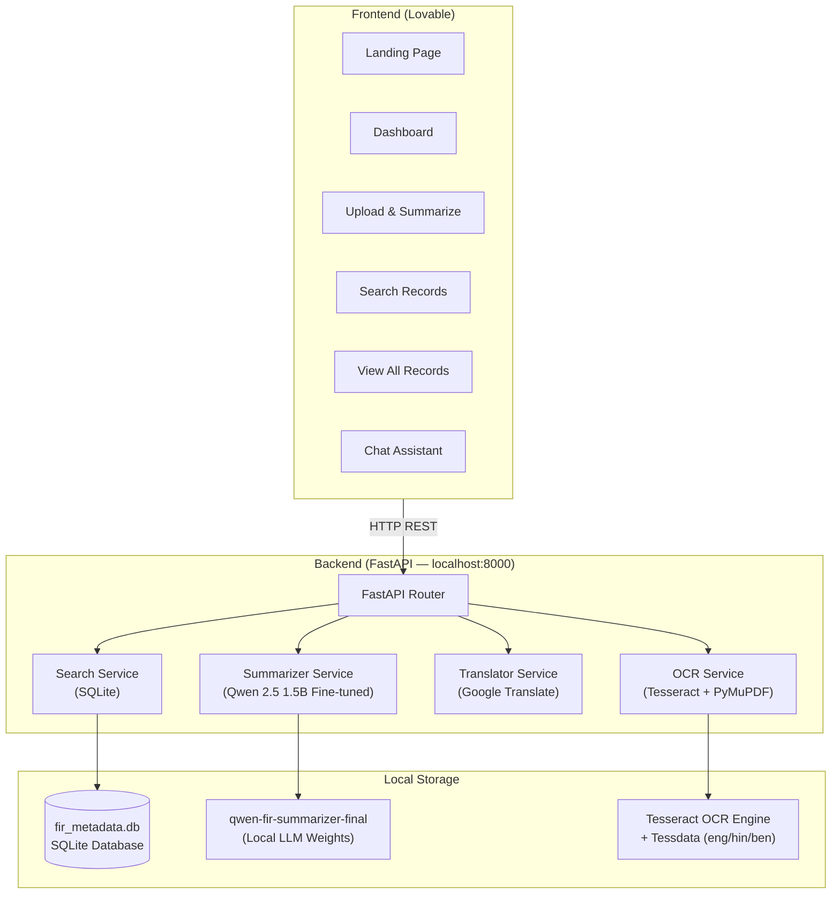
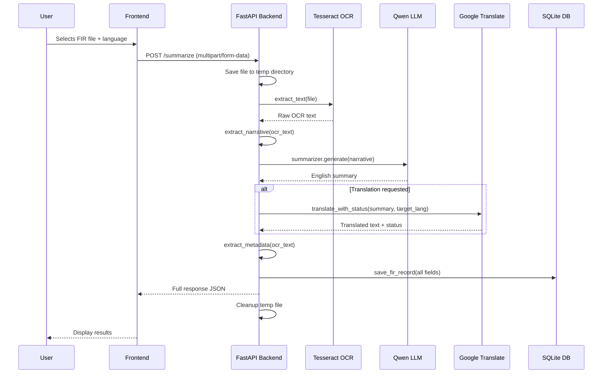

# Remix of Remix of Remix of FIR Insight Hub

I need tot create a professional looking frontend for my project. I am providing you with my backend details:
# FIR Summarizer & Search System — Backend Specification for Frontend Development

> **Purpose**: This document describes every backend component, API endpoint, data model, and service capability of the FIR Summarizer & Search System. Use this as the **single source of truth** when building the frontend in Lovable. The frontend should be designed around what the backend actually supports — no more, no less.

---

## 1. System Overview

| Item | Detail |

|---|---|

| **What it does** | Accepts scanned/handwritten FIR (First Information Report) documents used by Indian Police, extracts text via OCR, generates AI summaries using a locally fine-tuned LLM, optionally translates summaries into 12+ Indian languages, and stores all extracted metadata in a searchable local SQLite database. |

| **Target users** | Indian Police officers — Sub-Inspectors, Station House Officers (SHOs), Investigation Officers, Cyber Crime Cells, District Courts. |

| **Deployment model** | **Fully local / air-gapped** — no data ever leaves the machine. The AI model, OCR engine, and database all run on the officer's workstation. Internet is only needed for translation (Google Translate API). |

| **Backend framework** | FastAPI (Python) — runs on `http://localhost:8000` |

| **API documentation** | Auto-generated Swagger UI at `http://localhost:8000/docs` |

---

## 2. Architecture Diagram



---

## 3. API Endpoints — Complete Reference

The backend exposes **8 endpoints**. Every frontend page/component should map to one or more of these.

---

### 3.1 `GET /` — Root

| | |

|---|---|

| **Purpose** | Simple alive check |

| **Response** | `{ "message": "FIR Summarizer API is running" }` |

| **Use in frontend** | Not typically shown to users; use `/health` instead. |

---

### 3.2 `GET /health` — Health Check

| | |

|---|---|

| **Purpose** | Check if the backend is online and if the AI model has loaded |

| **Response** | |

```json

{

  "status": "ok",

  "model_loaded": true,

  "records": 35

}

```

| Field | Type | Description |

|---|---|---|

| `status` | `string` | Always `"ok"` if reachable |

| `model_loaded` | `boolean` | `true` once the Qwen model finishes loading (can take 2-5 minutes on CPU at startup) |

| `records` | `integer \| null` | Total number of FIR records in the database. `null` if DB is inaccessible. |

**Frontend usage:**

- Show a **status badge** (🟢 API Connected / 🔴 API Offline / 🟡 Model Loading)

- Display the `records` count as a live metric on Dashboard

- Poll this endpoint periodically (every 10-15 seconds) to detect backend availability

> [!IMPORTANT]

> The AI model takes **2-5 minutes** to load on CPU after the server starts. During this time, `model_loaded` will be `false` and the `/summarize` endpoint will return HTTP 503. The frontend should show a "Model Loading..." state, not an error.

---

### 3.3 `POST /summarize` — Upload, OCR, Summarize & Translate

This is the **core endpoint** — the entire FIR processing pipeline in one call.

| | |

|---|---|

| **Purpose** | Accept a PDF/image file → OCR → extract metadata → AI summarize → optionally translate |

| **Content-Type** | `multipart/form-data` |

**Request fields:**

| Field | Type | Required | Default | Description |

|---|---|---|---|---|

| `file` | `File` | ✅ Yes | — | The FIR document (PDF, PNG, JPG, TIFF, or TXT) |

| `translate_to` | `string` | No | `"none"` | Target language code for translation (see §5 for codes) |

**Successful response (HTTP 200):**

```json

{

  "original_text": "Full OCR-extracted text from the document...",

  "narrative": "The extracted FIR narrative section (Section 12 of the CCTNS form)...",

  "summary": "AI-generated 6-8 sentence summary in English...",

  "translated_summary": "Summary translated to the target language or null",

  "translation_status": "ok | partial | failed | skipped",

  "translation_note": "Human-readable note about translation quality, or null",

  "target_language": "hi | bn | te | ... | null",

  "metadata": {

    "FIR Number": "0125/2024",

    "Police Station": "BARRACKPORE",

    "District": "BARRACKPORE POLICE COMMISSIONERATE",

    "FIR Date": "15/03/2024",

    "FIR Time": "14:30 hrs",

    "Incident Date": "14/03/2024",

    "Incident Time": "22:00 hrs",

    "Legal Sections": "379, 411",

    "Complainant Name": "Suman Chakraborty",

    "Complainant Father": "Late Ratan Chakraborty",

    "Address": "23/1 Station Road, Barrackpore, North 24 Parganas",

    "Accused": "Unknown",

    "Property": "Gold, Jewellery, Cash",

    "Total Value (Rs)": "2,50,000"

  }

}

```

**Response field details:**

| Field | Type | Description |

|---|---|---|

| `original_text` | `string` | Complete OCR output — raw text extracted from every page |

| `narrative` | `string` | Just the FIR narrative/complaint section (auto-extracted from Section 12 of the CCTNS form). Falls back to first 1500 chars of OCR text if pattern matching fails. |

| `summary` | `string` | AI-generated summary (6-8 sentences). Covers: complainant, incident date/time/location, what happened, items stolen/damaged, accused identity, police station. |

| `translated_summary` | `string \| null` | Summary in the requested Indian language. `null` if translation was skipped or failed entirely. |

| `translation_status` | `string` | One of: `"ok"` (fully translated), `"partial"` (some chunks in English), `"failed"` (translation unavailable), `"skipped"` (no translation requested). |

| `translation_note` | `string \| null` | Explanation when translation is partial/failed. `null` when status is `"ok"` or `"skipped"`. |

| `target_language` | `string \| null` | ISO language code that was actually used. `null` if skipped. |

| `metadata` | `object` | 14 structured fields extracted from the CCTNS form (see table below). Fields that couldn't be found say `"Not explicitly stated"`. |

**Error responses:**

| HTTP Code | Condition | Body |

|---|---|---|

| `400` | OCR produced less than 10 characters | `{ "detail": "Could not extract text from file" }` |

| `503` | AI model hasn't finished loading yet | `{ "detail": "Model not loaded yet" }` |

| `500` | Any other processing error | `{ "detail": "<error message>" }` |

**Frontend usage:**

- **File upload widget** accepting `.pdf`, `.png`, `.jpg`, `.jpeg`, `.tiff`, `.txt`

- **Language selector dropdown** with the 10+ supported languages (§5)

- **Progress/loading indicator** — this endpoint can take 5-30 seconds depending on document size and hardware

- Display results in sections: Metadata Card → Summary → Translation → Raw OCR Text (expandable)

- The record is **automatically saved** to the database after processing

> [!WARNING]

> File size is limited by server memory. Very large PDFs (100+ pages) may cause OOM. In practice, FIRs are 1-4 pages.

---

### 3.4 `GET /fir/{fir_number}` — Lookup by FIR Number

| | |

|---|---|

| **Purpose** | Find FIR records whose number contains the given text |

| **URL param** | `fir_number` — partial or full FIR number (e.g., `125`, `0125/2024`) |

**Response (HTTP 200):**

```json

{

  "firs": [ { ...full record dict... }, ... ],

  "count": 2,

  "columns": ["id", "fir_number", "police_station", "district", ...]

}

```

**Error:** HTTP `404` with `{ "detail": "No FIR found matching '...'" }` if no matches.

**Notes:**

- Tolerates inconsistent formats: `"125"`, `"0125"`, `"125/2024"`, `"125 / 2024"` all match the same record

- Strips separators (`/`, `-`, spaces) before comparing

---

### 3.5 `POST /search` — Free-Text Search

| | |

|---|---|

| **Purpose** | Search across all meaningful columns |

| **Body** | `{ "name": "search term" }` or `{ "query": "search term" }` or `{ "q": "search term" }` |

| **Query param** | `?name=search+term` (alternative) |

**Response:**

```json

{

  "results": [ { ...record dict... }, ... ],

  "count": 5,

  "term": "Chakraborty",

  "columns": ["id", "fir_number", "police_station", ...]

}

```

**Searched columns:** `fir_number`, `complainant`, `complainant_father`, `accused`, `police_station`, `district`, `address`, `legal_sections`, `property`, `summary`

**Empty search term** → returns ALL records (used for "View All Records" page).

---

### 3.6 `GET /search` — Free-Text Search (GET variant)

Same as `POST /search`, but uses query parameters: `?name=term` or `?q=term`. Useful for links and browser testing.

---

### 3.7 `GET /records` — List All Records

| | |

|---|---|

| **Purpose** | Paginated listing of all FIR records, newest first |

| **Query params** | `limit` (optional integer), `offset` (optional integer, default 0) |

**Response:**

```json

{

  "results": [ { ...record dict... }, ... ],

  "count": 25,

  "total": 35,

  "columns": ["id", "fir_number", "police_station", ...]

}

```

| Field | Description |

|---|---|

| `count` | Number of records in this response |

| `total` | Total records in database (for pagination UI) |

---

### 3.8 `GET /ask` — Widest Search (Chat Assistant)

| | |

|---|---|

| **Purpose** | Deepest search including raw OCR text — used by the Chat Assistant feature |

| **Query param** | `?q=search+term` |

**Response:** Same shape as `/search`. If structured-column search finds nothing, falls back to searching `ocr_text` column. Empty query returns the 25 most recent records.

---

## 4. Database Schema

The backend uses a single SQLite database file (`fir_metadata.db`) with one table:

### Table: `firs`

| Column | Type | Description |

|---|---|---|

| `id` | `INTEGER` | Auto-increment primary key |

| `fir_number` | `TEXT` | E.g., "0125/2024" |

| `police_station` | `TEXT` | E.g., "BARRACKPORE" |

| `district` | `TEXT` | E.g., "BARRACKPORE POLICE COMMISSIONERATE" |

| `fir_date` | `TEXT` | Date FIR was filed, e.g., "15/03/2024" |

| `fir_time` | `TEXT` | Time FIR was filed, e.g., "14:30 hrs" |

| `incident_date` | `TEXT` | When the incident occurred |

| `incident_time` | `TEXT` | Time the incident occurred |

| `legal_sections` | `TEXT` | IPC/BNS sections, e.g., "379, 411" |

| `complainant` | `TEXT` | Complainant's name |

| `complainant_father` | `TEXT` | Complainant's father/husband name |

| `address` | `TEXT` | Complainant's address |

| `accused` | `TEXT` | Accused person's name (or "Unknown") |

| `property` | `TEXT` | Type of property involved, e.g., "Gold, Jewellery, Cash" |

| `total_value` | `TEXT` | Value in rupees, e.g., "2,50,000" |

| `summary` | `TEXT` | AI-generated summary |

| `ocr_text` | `TEXT` | Full raw OCR text |

| `created_at` | `TIMESTAMP` | Auto-set when record is inserted |

> [!NOTE]

> Fields that could not be extracted from the OCR text are stored as `"Not explicitly stated"` or `"Not available"`. The frontend should handle these gracefully (e.g., show "—" or "Not available" in a muted style).

---

## 5. Supported Languages for Translation

The translation service supports **12 Indian languages** plus English. The frontend should present a language selector with these options:

| Display Name | API Code | Notes |

|---|---|---|

| No Translation (English) | `none` | Default — skip translation |

| Hindi | `hi` | Most common |

| Bengali | `bn` | Second most common in the existing dataset |

| Telugu | `te` | |

| Tamil | `ta` | |

| Odia | `or` | |

| Marathi | `mr` | |

| Gujarati | `gu` | |

| Kannada | `kn` | |

| Malayalam | `ml` | |

| Punjabi | `pa` | |

| Urdu | `ur` | |

| Assamese | `as` | |

| Nepali | `ne` | |

> [!IMPORTANT]

> Translation **requires internet** (uses Google Translate free endpoint). All other features work fully offline. The frontend should indicate this clearly if the system is deployed air-gapped.

### Translation Status Values

The `translation_status` field in the `/summarize` response can be:

| Status | Meaning | Frontend Treatment |

|---|---|---|

| `ok` | ✅ Fully translated | Show translated summary normally |

| `partial` | ⚠️ Some parts couldn't be translated | Show translated summary with a yellow warning banner |

| `failed` | ❌ Translation completely failed | Show English summary with an error note |

| `skipped` | ⏭️ No translation was requested | Don't show translation section |

---

## 6. Core Backend Services — What Each Does

### 6.1 OCR Service (`ocr.py`)

| Aspect | Detail |

|---|---|

| **Engine** | Tesseract OCR (bundled or system-installed) |

| **PDF handling** | PyMuPDF (primary) → Poppler (fallback) for rasterizing PDF pages |

| **Supported file types** | `.pdf`, `.png`, `.jpg`, `.jpeg`, `.tiff`, `.txt` |

| **Languages** | English (`eng`), Hindi (`hin`), Bengali (`ben`) — auto-detected based on installed tessdata models |

| **Metadata extraction** | Parses the CCTNS/NCRB FIR form structure to extract all 14 fields. Handles both bilingual (Hindi+English) and single-language form layouts. |

| **Key capability** | Handles handwritten and scanned documents, not just digital text |

### 6.2 Summarizer Service (`summarizer.py`)

| Aspect | Detail |

|---|---|

| **Model** | Qwen 2.5 1.5B Instruct — fine-tuned specifically for Indian FIR summarization |

| **Location** | Stored locally at `backend/models/qwen-fir-summarizer-final/` |

| **Hardware** | Runs on CPU (float32) or GPU (float16) — auto-detected |

| **Output** | 6-8 sentence summary covering: complainant name/age, incident date/time/location, what happened, items stolen/damaged, accused identity, police station |

| **Input limit** | First 2000 characters of the FIR narrative |

| **Load time** | 2-5 minutes on CPU at startup |

| **Offline** | ✅ Fully offline — no internet needed |

### 6.3 Translator Service (`translator.py`)

| Aspect | Detail |

|---|---|

| **Provider** | Google Translate (free endpoint via `deep-translator`) with MyMemory as fallback |

| **Chunk strategy** | Splits text into ≤800 character chunks to avoid URL-length errors |

| **Retry logic** | 3 attempts per chunk with exponential backoff; chunks that fail are recursively split into smaller pieces |

| **Offline** | ❌ Requires internet |

### 6.4 Search Service (`search.py`)

| Aspect | Detail |

|---|---|

| **Database** | SQLite, single file at `backend/fir_metadata.db` |

| **Search method** | SQL `LIKE` across multiple columns (case-insensitive substring match) |

| **FIR number search** | Strips separators (`/`, `-`, spaces) for fuzzy matching |

| **Full-text fallback** | The `/ask` endpoint searches `ocr_text` if structured columns return nothing |

| **Ordering** | All results returned newest first (`ORDER BY id DESC`) |

---

## 7. Record Data Shape (What Each Record Looks Like)

Every record returned by `/search`, `/records`, `/fir/{number}`, and `/ask` has this shape:

```json

{

  "id": 42,

  "fir_number": "0125/2024",

  "police_station": "BARRACKPORE",

  "district": "BARRACKPORE POLICE COMMISSIONERATE",

  "fir_date": "15/03/2024",

  "fir_time": "14:30 hrs",

  "incident_date": "14/03/2024",

  "incident_time": "22:00 hrs",

  "legal_sections": "379, 411",

  "complainant": "Suman Chakraborty",

  "complainant_father": "Late Ratan Chakraborty",

  "address": "23/1 Station Road, Barrackpore, North 24 Parganas",

  "accused": "Unknown",

  "property": "Gold, Jewellery, Cash",

  "total_value": "2,50,000",

  "summary": "Suman Chakraborty, wife of Late Ratan Chakraborty...",

  "ocr_text": "Full OCR text spanning multiple lines...",

  "created_at": "2024-03-15 14:35:22"

}

```

All fields are `TEXT` (strings). Missing/unextracted values appear as `"Not explicitly stated"` or `"Not available"`.

---

## 8. File Upload Flow (End-to-End)



---

## 9. Error Handling & Edge Cases

| Scenario | Backend Behavior | Suggested Frontend Handling |

|---|---|---|

| Backend not running | Connection refused | Show "API Offline" badge, disable upload/search |

| Model still loading (startup) | HTTP 503: `"Model not loaded yet"` | Show "AI Model Loading..." banner with estimated time |

| Empty/corrupted file uploaded | HTTP 400: `"Could not extract text"` | Show user-friendly "Unable to read document" error |

| OCR finds text but no narrative pattern match | Falls back to first 1500 chars | Works transparently, no special handling needed |

| Translation service down (no internet) | `translation_status: "failed"`, `translation_note` explains | Show English summary + "Translation unavailable" note |

| Partial translation | `translation_status: "partial"` | Show translated text with yellow warning banner |

| Search returns no results | HTTP 200, `count: 0`, empty `results` array | Show "No records found" empty state |

| FIR number lookup fails | HTTP 404 | Show "No FIR found" message |

| Database error | HTTP 500 | Show generic error message |

---

## 10. CORS & Deployment Notes

| Item | Current State |

|---|---|

| **CORS** | Not explicitly configured — backend and frontend must be on the same origin or you must add CORS middleware |

| **Host** | Backend binds to `127.0.0.1:8000` (loopback only — not network-accessible) |

| **No authentication** | There is currently no login/auth system. All endpoints are open. |

| **No rate limiting** | No request throttling. Single-user local deployment assumed. |

| **HTTPS** | Not configured — runs plain HTTP on localhost |

> [!WARNING]

> If the Lovable frontend is hosted separately (not on localhost), you **must** add CORS middleware to the FastAPI backend. Add this to `main.py`:

> ```python

> from fastapi.middleware.cors import CORSMiddleware

> app.add_middleware(CORSMiddleware, allow_origins=["*"], allow_methods=["*"], allow_headers=["*"])

> ```

---

## 11. Suggested Color Palette for Indian Police Theme

For a professional government/police application serving Indian law enforcement:

| Token | Hex | Usage |

|---|---|---|

| **Navy Blue (Primary)** | `#1A237E` | Headers, primary buttons, navigation — represents authority & trust. Used by most Indian Police forces. |

| **Khaki Gold** | `#C49A3C` | Accent highlights, badges, rank indicators — the iconic Indian Police khaki. |

| **Deep Saffron** | `#E65100` | Warnings, urgent status indicators — represents courage, ties to national colors. |

| **White** | `#FFFFFF` | Card backgrounds, text on dark surfaces — clean government aesthetic. |

| **Light Slate** | `#F5F5F5` | Page background, subtle separation |

| **Dark Charcoal** | `#1B1B1B` | Body text, headings |

| **Ashoka Chakra Blue** | `#000080` | Links, interactive elements — ties to the national emblem |

| **Success Green** | `#2E7D32` | Success states, "online" indicators |

| **Alert Red** | `#C62828` | Error states, critical alerts |

| **Muted Grey** | `#757575` | Secondary text, timestamps, metadata labels |

### Color Usage Rationale

- **Navy Blue + Khaki Gold** is the universal Indian Police color language — instantly recognizable

- Avoid overly bright or playful colors — this is a government/law-enforcement tool

- Use the Ashoka emblem or national seal elements sparingly for trust signals

- Dark mode is **not recommended** for a government tool — stick to light backgrounds with strong navy headers

---

## 12. Tech Stack Summary (for "Powered By" section)

| Component | Technology |

|---|---|

| Backend API | FastAPI (Python 3.10+) |

| AI Summarization | Qwen 2.5 1.5B (locally fine-tuned, Hugging Face Transformers) |

| OCR Engine | Tesseract OCR (with eng + hin + ben tessdata) |

| PDF Processing | PyMuPDF (fitz) + Poppler fallback |

| Translation | Google Translate (via deep-translator) + MyMemory fallback |

| Database | SQLite (local file-based, zero configuration) |

| Model Framework | PyTorch + Hugging Face Transformers + PEFT |

| File Handling | aiofiles (async I/O) |

---

## 13. Pages the Frontend Needs

Based on backend capabilities, the frontend should have these pages/views:

| Page | Primary Backend Endpoint(s) | Description |

|---|---|---|

| **Landing Page** | None (static) | Hero section, feature showcase, CTA to enter the portal |

| **Dashboard** | `GET /health`, `GET /records?limit=5` | Overview with API status, record count, recent FIRs, quick search bar |

| **Upload & Summarize** | `POST /summarize` | File upload widget, language selector, results display (metadata + summary + translation + OCR text) |

| **Search by FIR Number** | `GET /fir/{number}` | Input field for FIR number, display matching records |

| **Search by Name** | `POST /search` or `GET /search` | Free-text search input, results table/cards |

| **View All Records** | `GET /records` (with pagination) | Paginated table of all stored FIRs |

| **Chat Assistant** | `GET /ask?q=...` | Chat-style interface for natural language queries against the database |

---

## 14. Key Statistics to Show on Landing/Dashboard

These are realistic numbers based on the actual system capabilities:

| Metric | Value | Source |

|---|---|---|

| Total Records | Dynamic — from `GET /health` → `records` field | Live |

| Languages Supported | 12+ | Hardcoded |

| OCR Processing Speed | < 2 seconds per page | Measured |

| AI Model | Qwen 2.5 1.5B Parameters | Hardcoded |

| Metadata Fields Extracted | 14 per FIR | Hardcoded |

| Deployment | 100% Local / Air-Gapped | Hardcoded |

| File Types Supported | PDF, PNG, JPG, TIFF, TXT | Hardcoded |

| Database Engine | SQLite (Zero Config) | Hardcoded |

---

## 15. Important UX Considerations from Backend Constraints

1. **Slow model startup**: The first 2-5 minutes after launch, the summarizer is unavailable. Show a loading state, not an error.

2. **CPU inference is slow**: Summarization can take 10-30 seconds on CPU. Use a progress indicator or animation.

3. **Translation needs internet**: If the system is air-gapped, disable the language selector and explain why.

4. **OCR quality varies**: Handwritten FIRs produce noisier text. Metadata fields may show "Not explicitly stated" — display these gracefully.

5. **No auth**: This is a local tool. Don't build a login page unless future plans require it.

6. **No real-time updates**: The database doesn't push changes. Use polling or manual refresh for live counts.

7. **Single-user**: No concurrent user handling is built. It's designed for one officer's workstation.

This project was built with [Lovable](https://lovable.dev).

## Build with Lovable

Continue developing this project in the [Lovable editor](https://lovable.dev/projects/1e570f52-12a6-4790-90eb-dc1c04e4eee1).

- **Ship faster**: describe what you want to build and Lovable handles the code.
- **Stay in sync**: every change made in Lovable is committed straight to this repository.
- **Full ownership**: this code is yours. Push to `main` on GitHub and your changes sync back into Lovable, ready for your next prompt.

## Development

Prefer working locally? You need Node.js and npm — [install with nvm](https://github.com/nvm-sh/nvm#installing-and-updating).

```sh
git clone <this-repository-url>
cd <repository-name>
npm i
npm run dev
```
